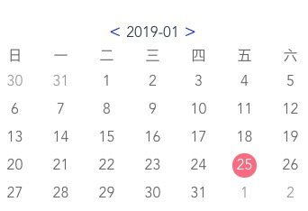

## Calendar
# Demo



The demo page is [HERE](http://qidaping.github.io/calendar/index.html).
> 日历选择插件
# API
 * show
 ```
  show: {
      type: Boolean,
      default: true
    }
 ```
 * onChange
 ```
 <html>
  <calendar :show="showValue" @on-change="getDateVal"></calendar>
 </html>
 <script>
   data () {
    return {
      date: '',
      showValue: false
    }
   }
   methods: {
    getDateVal (val) {
      this.date = val
    }
   }
 </script>
```
## Build Setup

``` bash
# install dependencies
npm install

# serve with hot reload at localhost:8080
npm run dev

# build for production with minification
npm run build

# build for production and view the bundle analyzer report
npm run build --report
```

For a detailed explanation on how things work, check out the [guide](http://vuejs-templates.github.io/webpack/) and [docs for vue-loader](http://vuejs.github.io/vue-loader).
